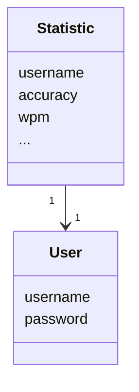
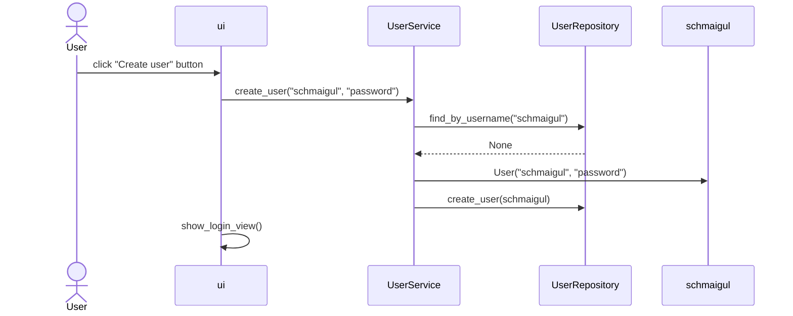
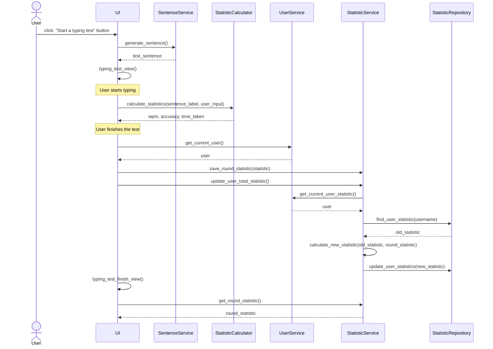
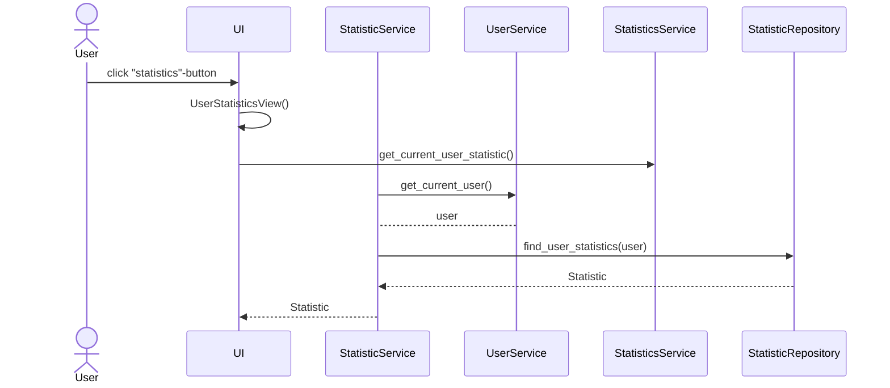

# Arkkitehtuurikuvaus

## Rakenne

Sovelluksen rakenne noudattaa kolmitasoista kerrosarkkitehtuuria, ja pakkausrakenne on seuraava:

Pakkaus `ui` on vastuussa käyttöliittymästä, `services` sovelluslogiikasta ja `reposiories` tietokantojen hallinnasta ja pysyväistallennuksesta. `entities` sisältää kaksi luokkaa, jotka kuvastavat sovelluksen tietokohteita.

## Käyttöliittymä

Käyttöliittymä sisältää viisi erillistä näkymää:

- Kirjautuminen

- Uuden käyttäjän luominen

- Päävalikko

- Kirjoitusharjoitus

- Kirjoitusharjoituksen lopputilastot

- Käyttäjän yleistilastot

Jokainen näkymä on toteutettu omana luokkanaan. Käyttäjä näkee aina vain yhden näkymän, josta vastaa `ui`-luokka. Käyttöliittymä on eriytetty lähes kauttaaltaan sovelluslogiikasta niin hyvin kuin mahdollista. Ainoastaa Typing-harjoitus sisältää hieman logiikkaa harjoituksen etenimestä. Muutoin käyttöliittymä kutsuu `service`-pakkauksen metodeja.

Kirjoitusharjoitus kutsuu `SentenceService`-, `StatisticService`-, ja `StatisticCalculator`-luokkien metodeja. `SentenceService`-luokka generoi lyhyen tekstipätkän, joka renderöidään `TypingTest`-näkymään. Sovellus kertoo, vastaako käyttäjän tähän asti kirjoittama lause annettua tekstipätkää muuttamalla syötteen tekstin väriä. Samalla `StatisticCalculator` laskee reaaliajassa tilastoja harjoituksesta, jotka renreröidään näytölle. Harjoituksen loputtua `StatisticService` tallentaa käyttäjän harjoituksen tilastot, ja laskee uudet kokonaistilastot. Harjoituksen tilastot renderöidään seuraavaan näkymään.

Käyttäjän kirjauduttua sisään on hänen mahdollisuus katsella aikaisempien kirjoitusharjoitusten kokonaistilastoja. Kokonaistilastot sisältävät keskimääräisiä tilastoja aikaisemmista harjoituksista (tarkkuus, wpm, total time taken etc.).

## Sovelluslogiikka

Sovelluksen loogisen tietomallin muodostavat luoka `User`ja `Statistic`, jotka kuvaavat käyttäjiä ja käyttäjien kirjoitusharjoitusten tilastoja.

Käyttäjätietojen tallentamisesta ja muusta toiminallisuudesta vastaa `UserService`-olio. Tilastojen tallentamisesta  ja päivittämisestä tietokantaan vastaa `StatisticService`-olio. Kumpiakin olioita on vain yksi, joita käyttöliittymä importtaa vaadittaviin näkymiin.

`UserService`-olio vastaa uuden käyttäjän luomisesta, sisäänkirjautumisesta ja kirjautuneen käyttäjän käyttäjänimen tuomisesta. `UserService` pääsee käsiksi käyttäjän tietoihin `UserRepository`-luokan kautta, jolla on yhteys tietokantaan.

`StatisticService`-olio tellentaa ja löytää käyttäjän tilastot käyttäjänimen perusteella. Se myös laskee ja päivittää käyttäjän kokonaistilastoja. `StatisticService` pääsee käsiksi käyttäjän tilastoihin `StatisticRepository`-luokan avulla, jolla on yhteys kokonaistilastojen tietokantaan

Sovelluksen osien suhdetta kuvaava luokka/pakkauskaavio:

### SentenceService

Kirjoitusharjoitusten generoimisesta vastaa `SentenceService`-luokka. Tämä luokka käyttää kirjastoa `essential-generators`, jonka avulla voidaan ladata internetistä satunnaisia tekstipätkiä. `SentenceService` sisältää metodin myös tekstin siivoamiseen, joka on toteutettu säännöllisillä lausekkeilla (regex). Lauseet ovat vähintään 10-sanan pituisia, ja ovat luonteeltaan erittäin satunnaisia. `SentenceService` tarjoaa toiminnallisuuden kahden lauseen vertailuun, [evaluate()](../TypingTest/src/services/sentence_service.py).Tämä metodi palauttaa värin indikoiden, vastaako käyttäjän siihen mennessä kirjoitettu syöte mallitekstin etuliitettä.

### StatisticsCalculator

`StatisticsCalculator`-luokka vastaa kirjoitusharjoitusten laskemisesta reaaliajassa. Luokka pystyy laskemaan kirjoittajan tarkkuuden, sanoja minuutissa (wpm), ja aikaa kulutettu harjoituksessa. Luokkaa käytetään `SentenceService`:n tavoin ainoastaan kirjoitusharjoitusta tehdessä, eikä se ole yhteydessä pysyväistalletukseen.

## Tietojen pysyväistallennus

Pakkauksen repositories luokat `UserRepository` ja `StatisticRepository` huolehtivat tietojen pysyväistalennuksesta. Kummatkin luokat tallentaa tietoja SQLite-tietokantaan 

Luokat noudattavat Repository-suunnittelumallia. Sovelluslogiikan testauksessa luodaan uudet testaustietokannat käyttäjille ja tilastoille, jolloin testaus ei vaikuta sovelluksen toimintaan.

## Tiedostot

Sovellus tallettaa käyttäjien ja tilastojen tiedot erillisiin tiedostoihin.

Sovelluksen juureen sijoitettu konfiguraatiotiedosto `.env` määrittelee tiedostojen nimet. Testauksessa on replikoitu sama käytäntö.

Käyttäjät ja tilastot tallennetaan SQLite-tietokantoihin tauluihin `users`ja `statistics`, joka alustetaan `initialize_database..py`-tiedostossa

# Päätoiminnallisuudet

Kuvataan seuraavaksi sovelluksen toimintalogiikkaa muutaman päätoiminnallisuuden osalta sekvenssikaaviona.

## Uuden käyttäjän luominen

Käyttäjä voi luoda uuden käyttäjätunnuksen kirjoittamalla käyttäjänimen ja salasanan. Käyttäjänimen pitää olla uniikki. Käyttäjän klikatessa "Create User" etenee sovelluksen kontrolli seuraavasti:

Tapahtumakäsittelijä kutsuu sovelluslogiikan metodia `create_user` antaen parametriksi luotavan käyttäjänimen ja salasanan. Sovelluslogiikka selvittää `UserRepository`:n avulla onko käyttäjätunnus olemassa. Jos ei, luo sovelluslogiikka `User`-olion ja tellentaa sen kutsumalla `UserRepository`-luokan metodia `create_user`. Uuden käyttäjän luotua käyttöliittymä vaihtaa ikkunaksi `LoginView`:n, jossa käyttäjä voi kirjoittaa aikaisemmat tietonsa ja kirjautua sisään.

## Kirjoitusharjoituksen kulku

Käyttäjän kirjauduttua sisään hän voi aloittaa typing testin, eli kirjoitusharjoituksen. Kirjoitusharjoituksen kulkua alusta loppuun demonstroidaan seuraavalla kaaviolla:

Tapahtumakäsittelijä kutsuu `SentenceService`:n luomaan uuden harjoituslauseen metodilla [generate_sentence()](../TypingTest/src/services/sentence_service.py), minkä käyttäjän pitää kirjoittaa. Harjoitus alkaa, kun käyttäjä aloittaa kirjoittamisen. Harjoituksen aikana tapahtumakäsittelijä päivittää käyttäjän tilastoja reaaliajassa kutsuen [StatisticCalculator](../TypingTest/src/services/statistic_calculator.py)-luokkaa. Harjoituksen loppuessa tapahtumakäsittelijä kutsuu `UserService`:n palauttamaan käyttäjänimen, jonka avulla luodaan uusi `Statistic`-olio. Tämä olio tallennetaan sovelluslogiikkaan seuraavaa näkymää varten [set_round_statistic()](../TypingTest/src/services/statistic_service.py#16)-metodilla. Sitten tapahtumakäsittelijä kutsuu `StatisticService`:n päivittämään käyttäjän kokonaistilastot tietokannassa [update_user_total_statistic()](../TypingTest/src/services/statistic_service.py#26)-metodilla. Sovelluslogiikka ensin etsii käyttäjän tilastot `StatisticRepository`:n kautta, laskee uudet tilastot, ja tallentaa ne samaan sijaintiin. Tämän jälkeen käyttäjälle aukeaa aiemmin tallennettu tiivistelmä viime harjoituksesta kutsumalla [get_round_statistic()](../TypingTest/src/services/statistic_service.py#13)-metodia.

## Tilastojen katseleminen

Demonstroidaan seuraavaksi kuinka sovellus hakee käyttäjän persoonalliset kokonaistilastot. Painettuaan päävalikossa "statistics"-tapahtuu seuraavasti:

Tapahtumakäsittelijä kutsuu `StatisticService`-luokkaa hakemaan kirjautuneen käyttäjän tilastoja metodilla `get_current_user_statistic()`. Tilastojen huolehtiminen on eriytetty käyttäjätietojen huolehtimisesta. Tästä syystä `StatisticService` kutsuu erikseen `UserService` hakemaan kirjautuneen käyttäjän. Itse `StatisticService` ei tiedä kuka on kirjautuneena sisään. `UserService` hakee kirjautuneen käyttäjän käyttäjänimen, jonka avulla `StatisticService` kutsuu tietokannasta huolehtivee `StatisticRepository`-luokkaa, joka palauttaa käyttäjän kokonaistilastot.

### Muut toiminnallisuudet

Muut sovelluksen toiminnallisuudet noudattavat samoja repositorio- ja service-mallien periaatteita. Käyttöliittymä on eriytetty lähes kauttaaltaan sovelluslogiikasta. Esimerkiksi kirjautuminen toimii hyvin samalla tavoin kuin uuden käyttäjän luominen.

## Ohjelman rakenteeseen jääneet heikkoudet

### Sovelluslogiikka

Ohjelma joskus tallentaa käyttäjän harjoitustilastot kaksi kertaa yhden sijasta. Lauseiden generoinnissa on vielä hiomista. Joskus vastaan saattaa tulla lause, jossa on sanoja, joita ei ole mahdollista kirjoittaa.