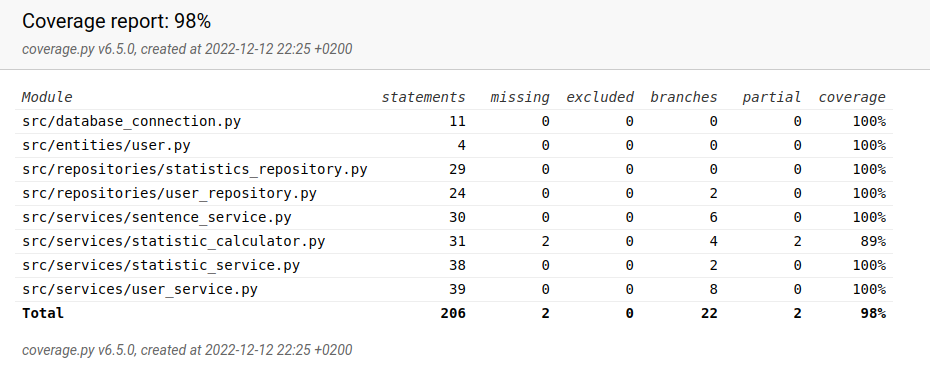

# Testausdokumentti

Sovellus on testattu sekä automatisoiduin yksikkö- ja integraatiotestein unittesteilla sekä manuaalisesti tapahtunein järjestelmätason testein.

## Yksikkö- ja integraatiotestaus

### Sovelluslogiikan testaus

Jokaista sovelluslogiikan luokkaa testataan omilla testausluokilla. `SentenceService`- ja `StatisticsCalculator`-luokkia testataan käymällä kaikki luokkien metodit läpi antaen parametreiksi realistiset arvot jotka voisivat esiintyä itse sovellusta käytettäessä.

Pysyväistallennusta vaativat luokat `UserService` ja `StatisticService` pyörivät valetietokannoilla, jotka alustetaan samalla tavalla kuin sovelluksen tietokannat, mutta omilla tiedostoilla, kansiossa [testing_environment/](../TypingTest/src/tests/testing_envionment/) Nämä valetiedostot sisältävät tiedostonimien konfiguraation, tietokantojen alustuksen, ja yhteyden luomisen. Käyttäjä voi siis konfiguroida näitäkin tiedostoja samalla tavalla, jotta testaus olisi mahdollisimman realistista. Tiedostojen nimet on konfiguroitu .env.test-tiedostoon.`StatisticService`:n ja `UserService`:n testaukset käyvät läpi kattavasti lähes kaikki mahdolliset tilanteet. 

### Repositorio-luokat

Repositorio-luokkia `StatisticRepository` ja `UserRepository` testataan myös samoilla valetiedostoilla, ja kummallekkin luokalle on omat testausluokat. Nämäkin testit käyvät aika läpikotaisesti kaikki metodit ja skenaariot.

### Testauskattavuus

Käyttöliittymäkerrosta lukuunottamatta sovelluksen testauksen haarautumakattavuus on 98%

Testaamatta jäi pari edge-casea, joiden en kokenut olevan tarpeellisia testattavaksi. Testattu on siis aika lailla kaikki oleelliset toiminnalisuudet hyvin yksityiskohtaisesti.

## Järjestelmätestaus

Sovelluksen järjestelmätestaus on suoritettu manuaalisesti

### Asennus ja konfigurointi

Sovellus on haettu ja sitä on testattu [käyttöohjeen](k%C3%A4ytt%C3%B6ohje.md) kuvaamalla tavalla Windows- ja Linux-ympäristöön. Testauksessa on kokeiltu eri arvoja konfiguraatiotiedostoon _.env_

Sovelluksen alustaminen on testattu eri konfiguraatioilla, jonka jälkeen sovellusta on käytetty tilanteissa, joissa käyttäjät ja tilastot ovat olleet jo muistissa ja joissa niitä ei ole ollut jolloin ohjelma on luonut ne itse.

### Toiminnallisuudet

Kaikki [määrittelydokumentin](vaatimusm%C3%A4%C3%A4rittely.md) ja käyttöohjeen listaamat toiminnallisuudet on käyty läpi. Kaikkien toiminnallisuuksien yhteydessä on syötekentät yritetty myös täyttää virheellisillä arvoilla. Kirjoitusharjoituksessa on testattu eri tapoja rikkoa harjoituksen etenemistä, ja tilastojen vääristämistä.